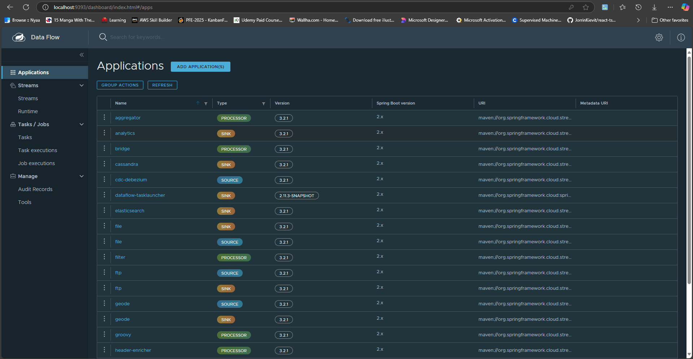
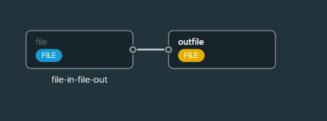
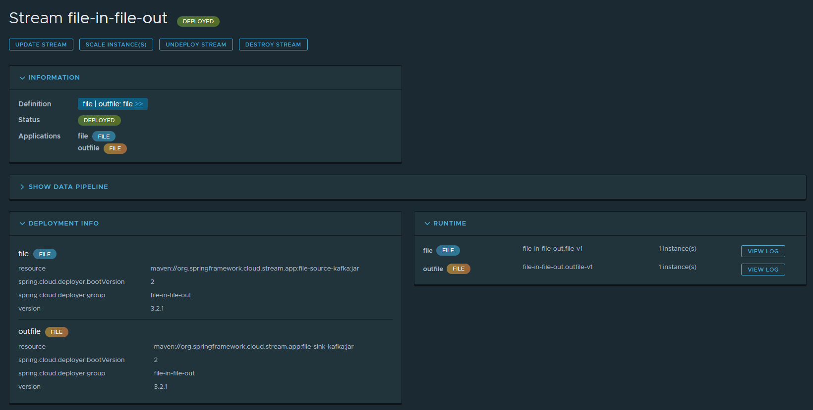
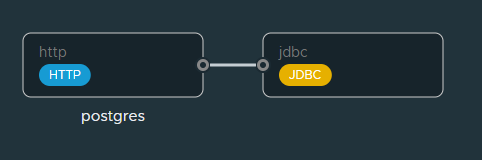
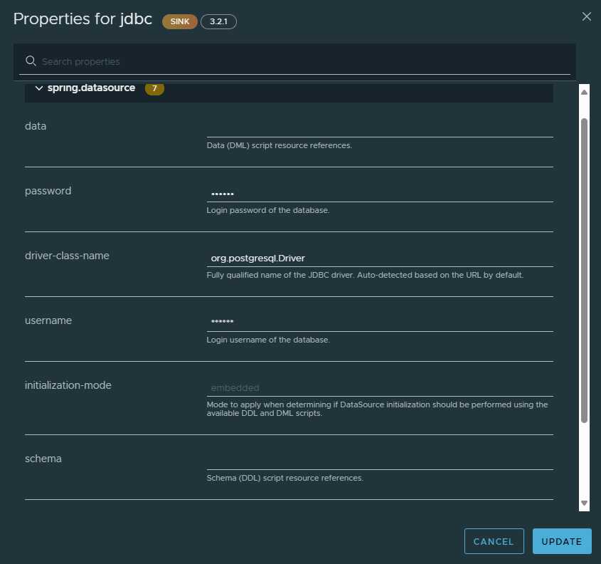
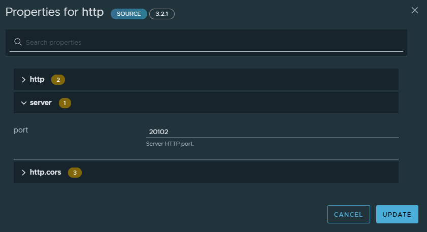
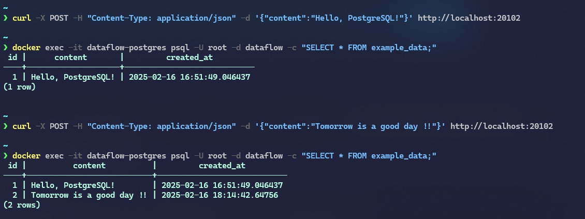

# **Spring Cloud Data Flow (SCDF) with Docker Compose**

## **Introduction**

<p align="center">
  
</p>

**Spring Cloud Data Flow (SCDF)** is a toolkit for building **data integration** and **real-time data processing pipelines**. It provides a **scalable and flexible** way to create, deploy, and manage **data pipelines** composed of microservices.

### **Key Components**

1. **Data Flow Server**: Manages the lifecycle of streams and tasks.
2. **Skipper Server**: Handles the deployment and versioning of stream applications.
3. **Stream Applications**: Pre-built microservices for common data processing tasks (e.g., sources, processors, sinks).
4. **Messaging Middleware**: **Kafka** or **RabbitMQ** is used for communication between stream applications.

This repository provides a **Docker Compose setup** to run SCDF locally, along with examples of stream applications.

---

## **Installation**

### **Prerequisites**

- **Docker** and **Docker Compose** installed on your machine.
- **Basic understanding of Docker and Spring Cloud Data Flow.**

### **Steps to Install SCDF Locally**

1. **Clone the Repository**:
   ```bash
   git clone https://github.com/Safwen-Saafi/Spring_Cloud_Data_Flow_Installation_Stream_Example
   cd Spring_Cloud_Data_Flow_Installation_Stream_Example
   ```

---

## **Start SCDF with Docker Compose**

Use the provided **docker-compose.yml**, **docker-compose-kafka.yml**, and **docker-compose-postgres.yml** files to start SCDF with Kafka and PostgreSQL.

> **Note:** Before running, update the `docker-compose.yml` file to include **volume mounts** for `dataflow-server` and `skipper-server`. Replace `/path/on/host/input` and `/path/on/host/output` with actual paths on your machine.

Run the following command:

```bash
docker-compose -f docker-compose.yml -f docker-compose-kafka.yml -f docker-compose-postgres.yml up
```

This will start the following services:

- **Data Flow Server**: Available at `http://localhost:9393`
- **Skipper Server**: Available at `http://localhost:7577/api`
- **Kafka**: Used as the messaging middleware
- **PostgreSQL**: Used as the database for SCDF and stream applications

> **Bonus:** Pre-built apps are **imported automatically** for later use in pipeline creation.

### **Access the SCDF Dashboard**

Once setup is complete, open your browser and navigate to:

```
http://localhost:9393/dashboard
```

<p align="center">
  
</p>

---

## **Stream Application Examples**

### **Example 1: File Processing Pipeline**

This example reads files from a **directory** and writes them to another **directory** using SCDF Dashboard (UI).

#### **Stream Definition**:

<p align="center">
  
</p>

```bash
file --directory=/mnt/input | output : file --directory=/mnt/output
```

#### **Steps**:

1. **Navigate to the Streams Section**:

   - Open SCDF Dashboard: `http://localhost:9393/dashboard`
   - Click **Streams** in the left-hand menu.

2. **Create a New Stream**:

   - Click **Create Stream(s)**.
   - Define the stream using the **DSL**:
     ```
     file --directory=/mnt/input | output : file --directory=/mnt/output
     ```
   - Click **Create Stream**.

3. **Deploy the Stream**:
   - Locate the stream in the **Streams** section.
   - Click **Deploy** → **Deploy Stream**.

<p align="center">
  
</p>

4. **Test the Stream**:
   - Place a file in the `/mnt/input` directory on your host machine.
   - The file will be **processed** and moved to `/mnt/output`.

---

### **Example 2: Writing Data to PostgreSQL**

This example writes data received via **HTTP** to a **PostgreSQL** database.

#### **Stream Definition**:

<p align="center">
  
</p>

```bash
http | jdbc --table-name=example_data --columns=content
```

#### **Steps**:

1. **Create a Table in PostgreSQL**

   Connect to the **PostgreSQL** container and create a table:

   ```bash
   docker exec -it dataflow-postgres psql -U root -d dataflow -c "CREATE TABLE example_data (id SERIAL PRIMARY KEY, content TEXT, created_at TIMESTAMP DEFAULT CURRENT_TIMESTAMP);"
   ```

2. **Navigate to the Streams Section**

   - Open SCDF Dashboard: `http://localhost:9393/dashboard`
   - Click **Streams** in the left-hand menu.

3. **Create a New Stream**:

   - Click **Create Stream(s)**.
   - Define the stream using the **DSL**:
     ```
     http | jdbc --table-name=example_data --columns=content
     ```
   - Click **Create Stream**.

4. **Deploy the Stream**:

   - Locate the stream in the **Streams** section.
   - Click **Deploy** → **Deploy Stream**.
   - Configure deployment properties:

    <p align="center">
     
    </p>

   ```
   url = jdbc:postgresql://postgres:5432/dataflow
   username = root
   password = rootpw
   driver-class-name = org.postgresql.Driver
   ```

   - For the **HTTP source**, choose a port **between 20100 and 20190**.

    <p align="center">
     
    </p>

   - Click **Deploy Stream**.

5. **Test the Stream**:

   - Send data using `curl`:
     ```bash
     curl -X POST -H "Content-Type: application/json" -d '{"content":"Hello, PostgreSQL!"}' http://localhost:<http-source-port>
     ```
   - **Replace** `<http-source-port>` with the actual assigned port.

6. **Verify Data**:
   - Query the PostgreSQL table:
     ```bash
     docker exec -it dataflow-postgres psql -U root -d dataflow -c "SELECT * FROM example_data;"
     ```

    <p align="center">
     
    </p>
